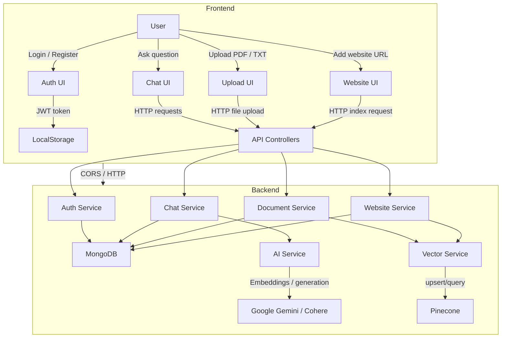

# Multi-Source RAG

A full-stack Retrieval-Augmented Generation (RAG) proof-of-concept built with:

- **React + Vite + TypeScript** frontend
- **NestJS + TypeScript** backend
- **MongoDB** for chat, document, website, and user persistence
- **Pinecone** for vector embeddings and semantic retrieval
- **Google Gemini** for embedding generation and answer synthesis
- **Cohere** optional reranking and scoring
- **PDF/text upload** and **website crawling** for multi-source knowledge ingestion

## What this project does

This app lets authenticated users upload documents and index websites into a shared RAG workspace, then ask questions over the combined knowledge sources.

Key features:

- User registration and authentication with JWT
- Chat session management and persistent history
- Document upload support for PDF and plain text files
- Website crawling and indexing for live URL sources
- Semantic embeddings stored in Pinecone
- Question answering backed by retrieved context with citations
- Swagger API documentation for the backend

## Architecture overview



## Getting started

### Backend

1. Open a terminal and go to the `server` directory:

```bash
cd server
```

2. Install dependencies:

```bash
npm install
```

3. Create a `.env` file with at least these values:

```ini
MONGODB_URI=mongodb://localhost:27017/multi-source-rag
PINECONE_API_KEY=your_pinecone_api_key
PINECONE_INDEX_NAME=your_pinecone_index_name
GEMINI_API_KEY=your_google_gemini_api_key
COHERE_API_KEY=your_cohere_api_key   # optional
PORT=3000
```

4. Start the backend server in development mode:

```bash
npm run start:dev
```

5. API docs will be available at:

```text
http://localhost:3000/api
```

### Frontend

1. Open another terminal and go to the `client` directory:

```bash
cd client
```

2. Install dependencies:

```bash
npm install
```

3. Start the frontend dev server:

```bash
npm run dev
```

4. Open the app in your browser, usually at:

```text
http://localhost:5173
```

> If your backend runs on a different host or port, update `API_BASE` in `client/src/App.tsx`.

## How to use it

1. Register or login with an email and password.
2. Create a new chat session or select an existing session.
3. Upload a PDF or text file using the drag-and-drop document uploader.
4. Add a website URL to crawl and index its content.
5. Ask questions in the chat box to get answers generated from the uploaded documents and indexed webpages.
6. The system returns answers with citations from the retrieved sources.

## Important endpoints used by the frontend

- `POST /auth/register`
- `POST /auth/login`
- `POST /chat/session`
- `GET /chat/sessions`
- `GET /chat/history/:chatId`
- `POST /chat/ask/:chatId`
- `POST /document/upload/:chatId`
- `GET /document/:chatId`
- `POST /website/index/:chatId`
- `GET /website/:chatId`

## Notes

- The backend uses `app.enableCors()` so the frontend can connect from a different port.
- Authentication uses a bearer token stored in browser local storage.
- The app relies on external AI providers and Pinecone, so valid API keys and working connectivity are required.
- Swagger docs are enabled for the Nest backend and can help explore available API routes.

---

## Repository layout

- `client/` — React + Vite UI
- `server/` — NestJS API and RAG backend
- `server/src/ai/` — AI integrations and prompt logic
- `server/src/vector/` — Pinecone vector storage
- `server/src/document/` — PDF/text upload and storage
- `server/src/website/` — URL crawling and website indexing
- `server/src/chat/` — chat and question-answering flow
- `server/src/auth/` — authentication and JWT guard
- `server/src/user/` — user schema and user persistence

Enjoy exploring the multi-source RAG app!
